# Documentación Técnica — VPN Site-to-Site entre FortiGate A y FortiGate B

**Autor:** Junior Javier Santos Pérez
**Matrícula:** 2024-1599
**Fecha:** Junio 2026

Video demostrativo: https://www.youtube.com/watch?v=16_GxHjg70Q

Enlace GitHub: 

---

## 1. Objetivo de la VPN

Esta práctica implementa una **VPN Site-to-Site** basada en **IPsec (IKEv2)** entre dos dispositivos **FortiGate** ubicados en sitios remotos, interconectados a través de un router intermedio (**R-ISP**) que simula el proveedor de internet.

El objetivo es lograr que dos redes LAN privadas, físicamente separadas y conectadas solo a través de una red pública/WAN, puedan **comunicarse de forma segura y transparente** como si estuvieran en la misma red local, encapsulando y cifrando todo el tráfico que viaja entre ellas.

### Objetivos específicos
- Establecer un túnel IPsec Site-to-Site entre **FGT-A** y **FGT-B**.
- Permitir la comunicación bidireccional entre la LAN-A (`10.15.99.0/24`) y la LAN-B (`192.168.99.0/24`).
- Garantizar que el tráfico entre ambas LAN viaje **cifrado** y **no por la ruta pública normal**, sino encapsulado dentro del túnel.
- Verificar la conectividad extremo a extremo mediante `ping` y `traceroute`.

---

## 2. Topología de red

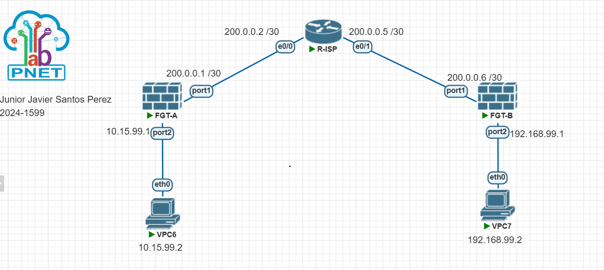
*IMAGEN1 — Topología general del laboratorio: dos FortiGate (FGT-A y FGT-B), un router ISP intermedio (R-ISP) y dos hosts finales (VPC6 y VPC7), cada uno representando una LAN distinta.*

### 2.1 Direccionamiento IP

| Equipo  | Interfaz | Dirección IP        | Máscara          | Rol                                  |
|---------|----------|----------------------|-------------------|----------------------------------------|
| R-ISP   | e0/0     | 200.0.0.2            | /30 (255.255.255.252) | Enlace hacia FGT-A                  |
| R-ISP   | e0/1     | 200.0.0.5            | /30 (255.255.255.252) | Enlace hacia FGT-B                  |
| FGT-A   | port1    | 200.0.0.1            | /30                | WAN — enlace hacia R-ISP               |
| FGT-A   | port2    | 10.15.99.1           | /24                | Gateway de la LAN-A                    |
| FGT-B   | port1    | 200.0.0.6            | /30                | WAN — enlace hacia R-ISP               |
| FGT-B   | port2    | 192.168.99.1         | /24                | Gateway de la LAN-B                    |
| VPC6    | eth0     | 10.15.99.2           | /24                | Host de prueba en LAN-A                |
| VPC7    | eth0     | 192.168.99.2         | /24                | Host de prueba en LAN-B                |

> No se utilizaron VLANs en este laboratorio: cada segmento de red está separado físicamente por interfaz dedicada (port1 = WAN, port2 = LAN) en cada FortiGate.

### 2.2 Interfaz virtual de túnel VPN

| FortiGate | Nombre del túnel | Interfaz física asociada |
|-----------|--------------------|------------------------------|
| FGT-A     | `VPN-A-B`           | port1                        |
| FGT-B     | `VPN-B-A`           | port1                        |

---

## 3. Parámetros de la VPN Site-to-Site (IPsec)

| Parámetro             | Valor configurado          |
|------------------------|------------------------------|
| Versión IKE            | IKEv2                        |
| Tipo de peer           | any                           |
| Proposal (cifrado)     | des-sha256                   |
| Grupo Diffie-Hellman   | 14                            |
| Gateway remoto FGT-A   | 200.0.0.6 (FGT-B)             |
| Gateway remoto FGT-B   | 200.0.0.1 (FGT-A)             |
| Autenticación          | Clave precompartida (PSK)     |
| Selector Fase 2 FGT-A  | src: 10.15.99.0/24 → dst: 192.168.99.0/24 |
| Selector Fase 2 FGT-B  | src: 192.168.99.0/24 → dst: 10.15.99.0/24 |
| net-device             | disable                       |
| DPD                    | on-demand                     |

> **Nota:** los selectores de Fase 2 deben ser exactamente espejo entre ambos extremos (la red origen de un lado debe ser la red destino del otro), de lo contrario la negociación de la SA de IPsec falla aunque la Fase 1 (IKE) se complete.

---

## 4. Verificación de la configuración (con evidencia)

### 4.1 Estado del router ISP

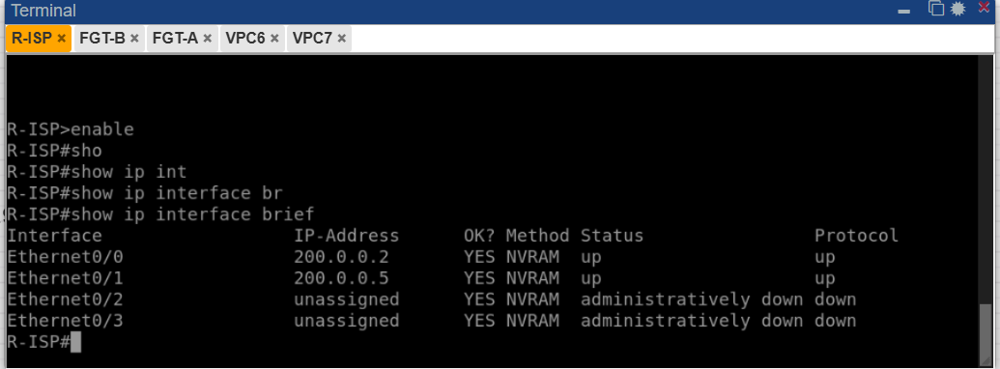
*IMAGEN9 — Salida de `show ip interface brief` en R-ISP. Confirma que ambas interfaces (Ethernet0/0 hacia FGT-A y Ethernet0/1 hacia FGT-B) están `up/up`, lo cual es indispensable para que la negociación IKE entre los dos FortiGate pueda atravesar el ISP.*

---

### 4.2 Estado del túnel IPsec en FGT-A

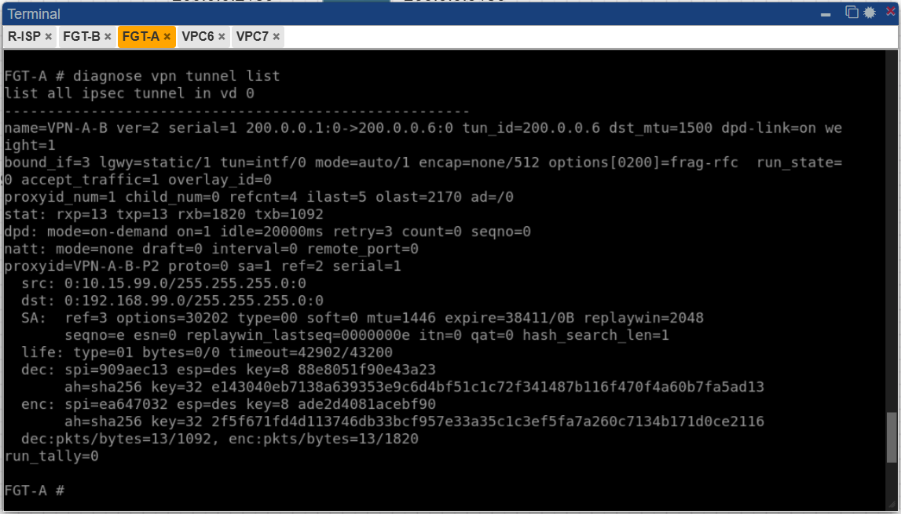
*IMAGEN2 — Salida de `diagnose vpn tunnel list` en FGT-A. Se observa `name=VPN-A-B`, la dirección del túnel `200.0.0.1:0->200.0.0.6:0`, y las estadísticas `stat: rxp=13 txp=13 rxb=1820 txb=1092`, lo que confirma tráfico real cifrado pasando en ambas direcciones por el túnel. También se muestran los selectores de Fase 2 (`src: 10.15.99.0/24`, `dst: 192.168.99.0/24`) y las claves de cifrado/autenticación (`dec`/`enc`) generadas dinámicamente para la sesión.*

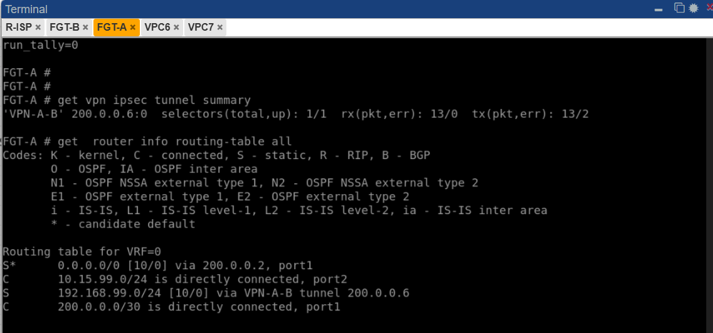
*IMAGEN3 — Salida de `get vpn ipsec tunnel summary` y `get router info routing-table all` en FGT-A. El resumen confirma `selectors(total,up): 1/1`, es decir, el selector de Fase 2 está activo. La tabla de ruteo muestra las tres rutas necesarias: el **default route** (`0.0.0.0/0 via 200.0.0.2, port1`) para alcanzar al peer remoto, la ruta hacia la **LAN remota** (`192.168.99.0/24 via VPN-A-B tunnel 200.0.0.6`) y las redes directamente conectadas.*

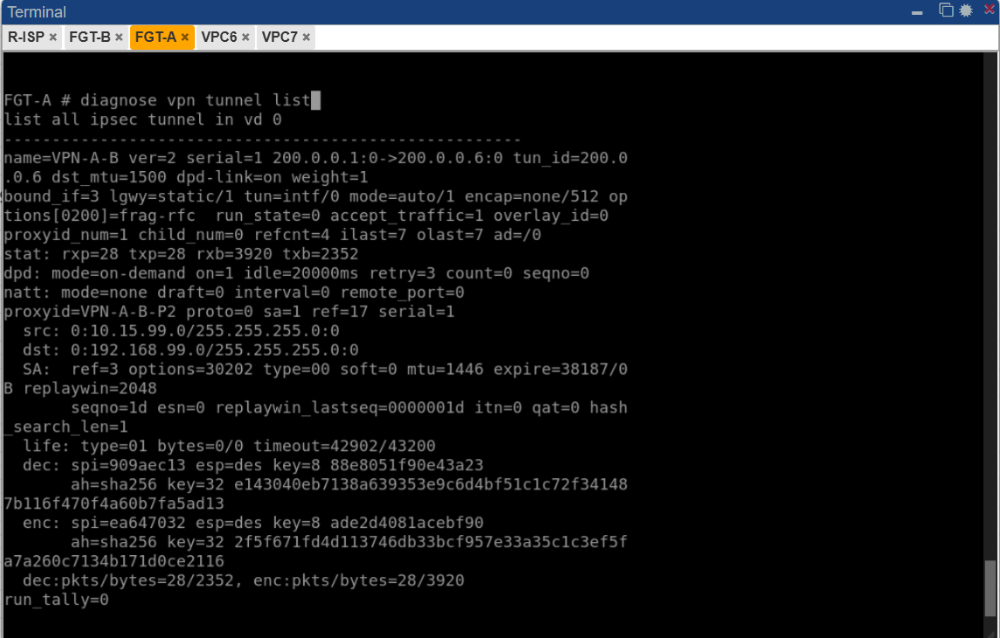
*IMAGEN4 — Segunda verificación de `diagnose vpn tunnel list` en FGT-A, tomada después de las pruebas de ping. El contador subió a `rxp=28 txp=28`, demostrando que el túnel sigue activo y efectivamente cursando el tráfico generado por las pruebas de conectividad.*

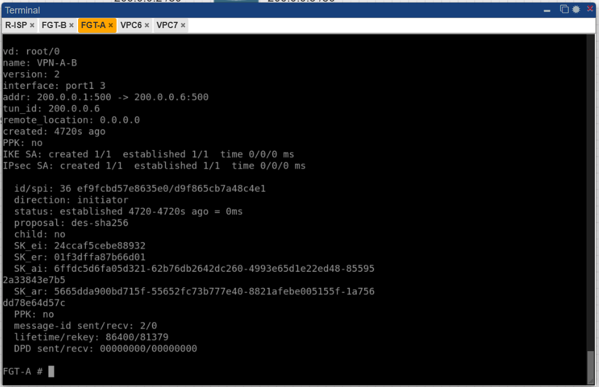
*IMAGEN5 — Salida de `diagnose vpn ike gateway list` en FGT-A. El campo clave es `status: established`, que confirma que la Fase 1 (negociación IKE) se completó exitosamente entre `200.0.0.1` (FGT-A, rol `initiator`) y `200.0.0.6` (FGT-B). También se observa el detalle de las claves de sesión (SK_ei, SK_er, SK_ai, SK_ar) generadas por el algoritmo Diffie-Hellman.*

---

### 4.3 Estado del túnel IPsec en FGT-B

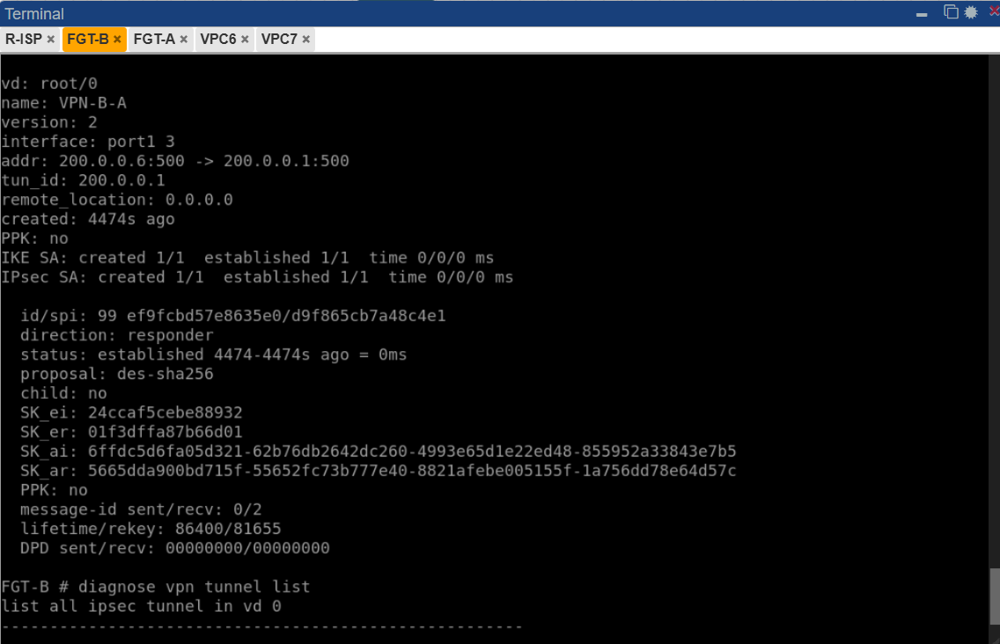
*IMAGEN6 — Salida de `diagnose vpn ike gateway list` en FGT-B. Confirma `status: established`, esta vez con FGT-B actuando como `responder` de la negociación iniciada por FGT-A. Las claves de sesión (`SK_ei`, `SK_er`, etc.) coinciden con las mostradas en FGT-A, ya que son producto de la misma negociación Diffie-Hellman entre ambos extremos.*

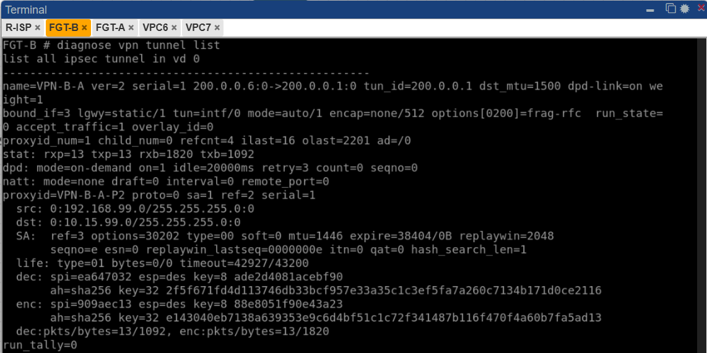
*IMAGEN7 — Salida de `diagnose vpn tunnel list` en FGT-B. Se observa el túnel `VPN-B-A` con dirección `200.0.0.6:0->200.0.0.1:0` y estadísticas `rxp=13 txp=13`, simétricas a las observadas en FGT-A, lo que confirma que el tráfico fluye correctamente en ambos sentidos del túnel.*

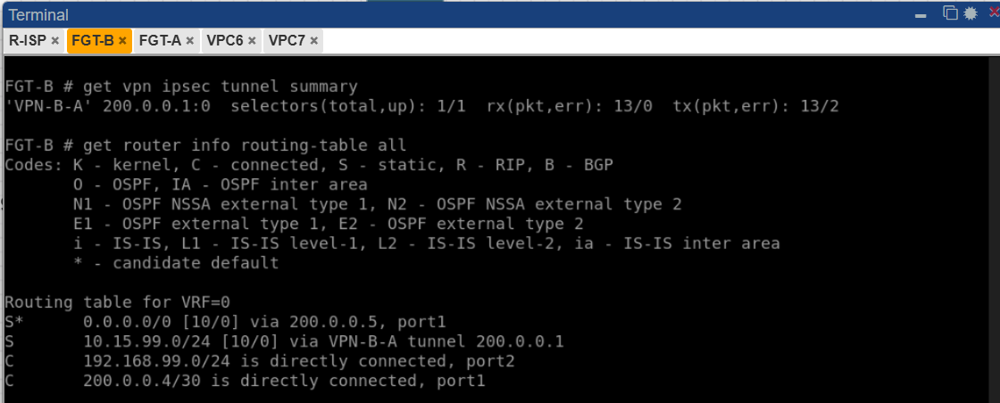
*IMAGEN8 — Salida de `get vpn ipsec tunnel summary` y `get router info routing-table all` en FGT-B. Igual que en FGT-A, se confirma el default route hacia el ISP (`0.0.0.0/0 via 200.0.0.5, port1`) y la ruta estática hacia la LAN remota (`10.15.99.0/24 via VPN-B-A tunnel 200.0.0.1`), ambas indispensables para que la VPN funcione en ambos sentidos.*

---

### 4.4 Prueba de conectividad extremo a extremo

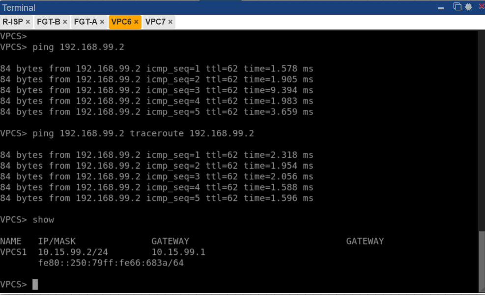
*IMAGEN10 — Desde VPC6 (`10.15.99.2`) se ejecuta `ping 192.168.99.2`, obteniendo respuesta exitosa con `ttl=62` en todos los paquetes. El comando `show` confirma la configuración del host: IP `10.15.99.2/24` y gateway `10.15.99.1` (interfaz port2 de FGT-A).*

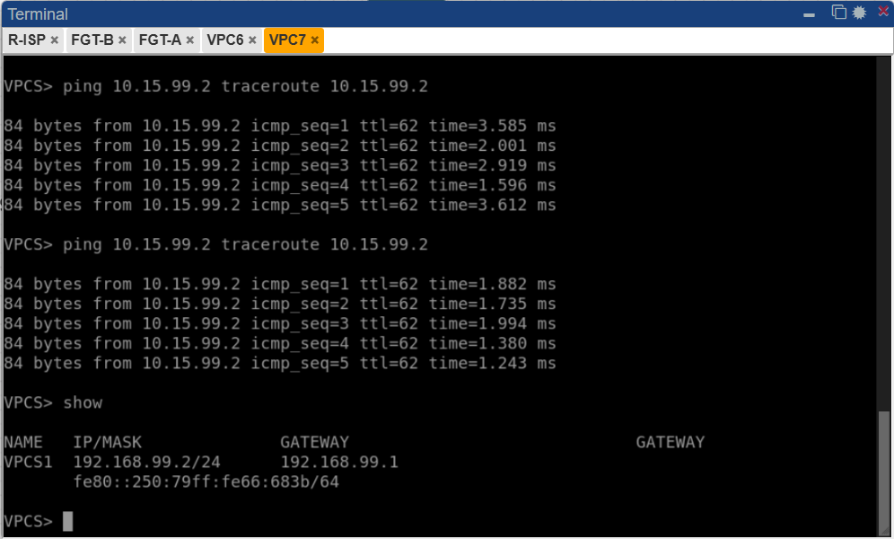
*IMAGEN11 — Desde VPC7 (`192.168.99.2`) se ejecuta `ping 10.15.99.2`, también con respuesta exitosa y `ttl=62` en todos los paquetes. El comando `show` confirma la IP `192.168.99.2/24` y gateway `192.168.99.1` (interfaz port2 de FGT-B). Esto demuestra comunicación **bidireccional** completa entre las dos LAN a través del túnel VPN Site-to-Site.*

> El valor `ttl=62` en ambos sentidos es consistente con el tráfico viajando encapsulado dentro del túnel IPsec (un solo "salto lógico" entre gateways), en lugar de atravesar visiblemente la red pública intermedia.

---

## 5. Conclusión

La VPN Site-to-Site entre FGT-A y FGT-B quedó configurada y verificada exitosamente:

- **Fase 1 (IKE):** establecida en ambos extremos (`status: established`).
- **Fase 2 (IPsec):** selectores activos y simétricos (`selectors(total,up): 1/1`) en ambos FortiGate.
- **Enrutamiento:** rutas estáticas correctas hacia el peer remoto (default route) y hacia la LAN remota (a través de la interfaz del túnel) en ambos equipos.
- **Conectividad:** `ping` exitoso en ambas direcciones entre `10.15.99.2` y `192.168.99.2`, confirmando comunicación cifrada y funcional entre las dos LAN.

Para el detalle completo del script de configuración utilizado en cada equipo, ver **`README-configuracion.md`**.
